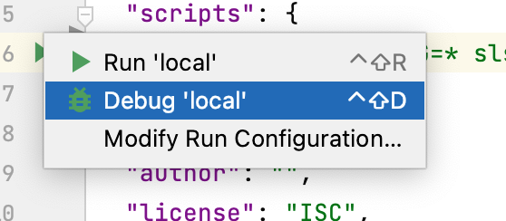

### Install deps
```sh
npm i
```


### Run the project
```text
npm run local
```
### To debug



### To test out the endpoint run:
```curl
curl -X POST --location "http://localhost:3009/dev/hello/slavi"
```

or run `hello.rest` in root directory
